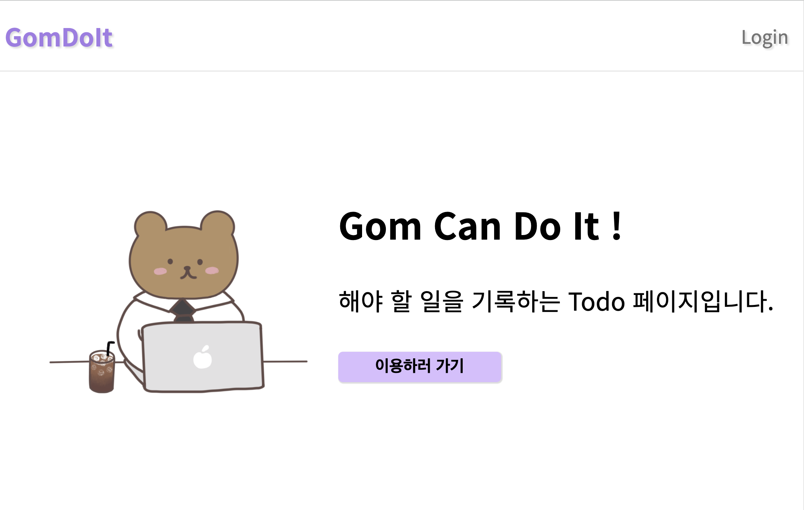
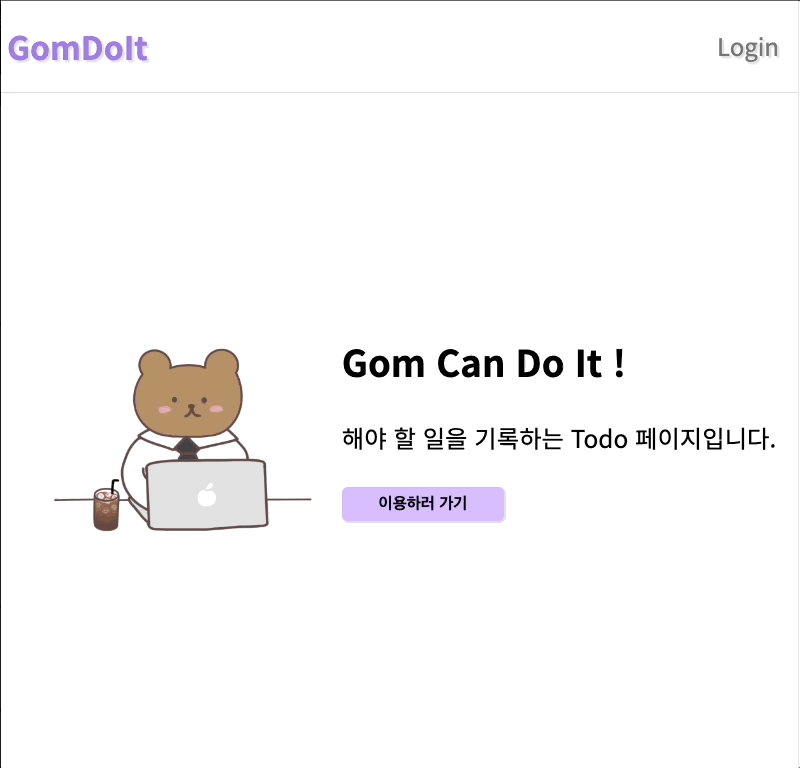
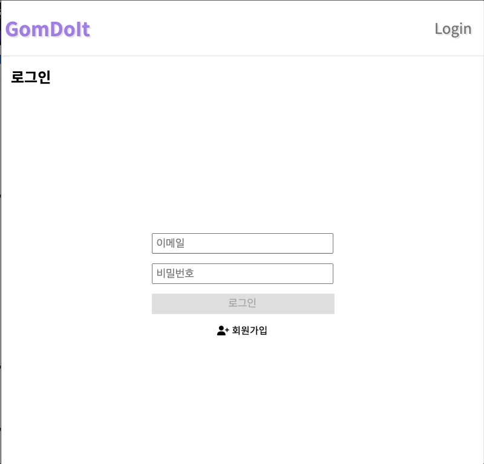
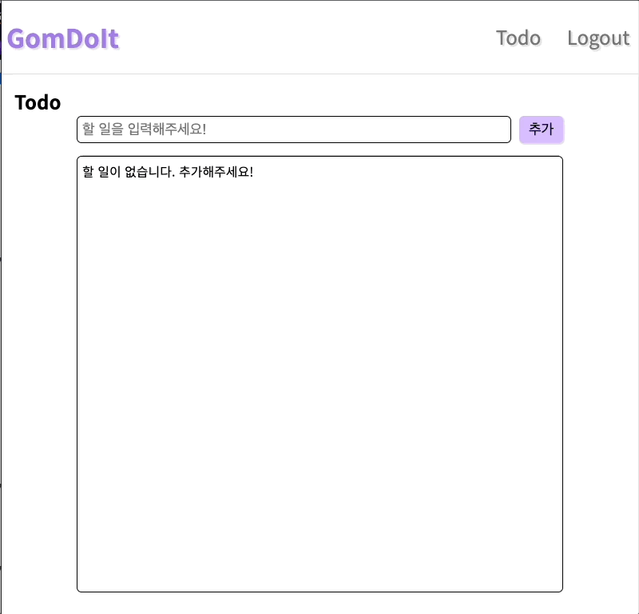

# 원티드 프리온보딩 프론트엔드 선발 과제 (Todo Web)

## 🐻 [GomToDo] 서비스 소개

### 요약
* 해야 할 일을 기록하고 완료 여부를 체크하는 웹 사이트
### 사용 기술
* Client -  
* Deploy -  

---

## 🐻 프로젝트의 실행 방법
### `1. npm install`
프로젝트에 필요한 패키지 설치
### `2. npm start`
[http://localhost:3000](http://localhost:3000) 에 개발서버가 실행되며 접속 시 사이트 확인 가능

---

## 🐻 데모 영상
### `1. 배포 URL`
http://15.164.44.236/

### `2. 샘플 영상`
#### 회원가입

#### 로그인

#### Todo (추가, 수정, 삭제, 완료)
